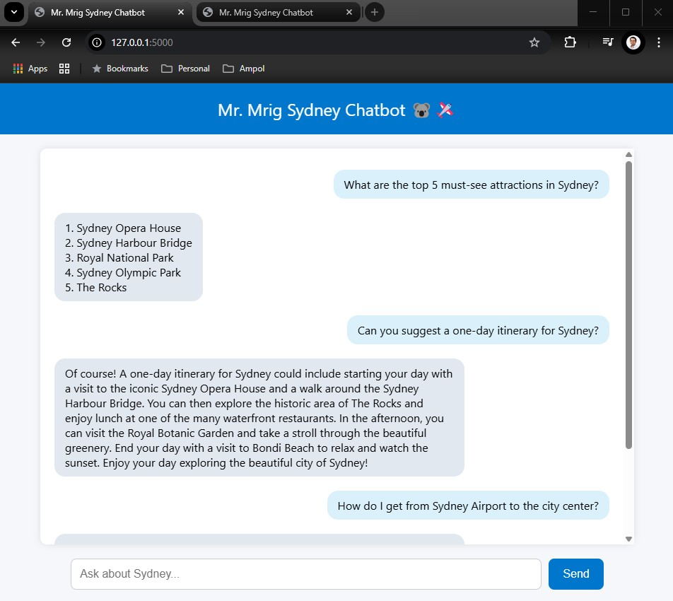
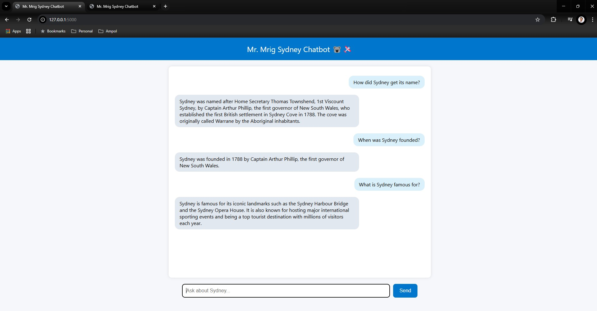

<p align="center">
  
  
  
  
</p>

<p align="center">
  <a href="https://render.com/deploy">
    
  </a>
</p>

# Mr. Mrig Sydney RAG Chatbot 🐨🛩️

A full-stack **Retrieval-Augmented Generation (RAG)** chatbot trained on live content scraped from Wikipedia (Sydney page).  
Built to demonstrate practical AI product engineering: scraping ➔ vectorizing ➔ retrieval ➔ real-time chat.

---

## 🚀 Features

- 🌐 Live **web scraping** with BeautifulSoup
- 🧠 **Vector embedding** using HuggingFace models + **FAISS** vector database
- 🤖 **RAG pipeline** with **OpenAI GPT-3.5 Turbo**
- 🖥️ Minimalistic **Flask web app** with live chat interface
- 🔄 **Auto vectorstore management** (create, load, save)
- ☁️ **One-click deploy to Render**

---

## 📊 Demo Screenshot Chat 1


## 📊 Demo Screenshot Chat 1


## 📂 Project Structure

sydney-rag-chatbot/ ├── app.py # Main application (Flask + RAG logic) ├── requirements.txt # Python dependencies ├── render.yaml # Render deployment configuration ├── templates/ │ └── index.html # Simple frontend for chatting ├── website_text.txt # (Generated) scraped Wikipedia text ├── faiss_db_folder/ # (Generated) FAISS vector database ├── .env.example # Template for environment variables └── README.md # Documentation


---

## 🔑 Environment Variables

To run this project, you need to configure the following environment variable:

| Variable         | Purpose                                          |
|:-----------------|:-------------------------------------------------|
| `OPENAI_API_KEY` | Your OpenAI API key for accessing GPT-3.5 models |

---

### 💻 How to Set It Locally

- Create a `.env` file in your project root.
- Add this line:

```plaintext
OPENAI_API_KEY=your-openai-api-key-here
